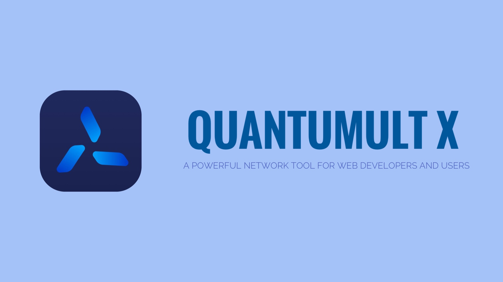

> 方便自己的不完全指北（自用配置）

# 


正文将包含两方面内容 `流量分流` 以及 `Gallery 订阅` 

## 流量分流

> 目前暂时只提供远程配置文件（自己库应该会越来越全的）

> 远程配置将会轻微修改您的 `节点名称` 使其看起来更优雅切规范

* **subconverter.ini**: [https://raw.githubusercontent.com/5t-RawBeRry/Public-Store/main/subconverter.ini](https://raw.githubusercontent.com/5t-RawBeRry/Public-Store/main/subconverter.ini)

## Gallery 订阅

> 目录结构

```bash
├── Addons
│   ├── BiliBili-Comic_Remote_Cookie.conf
│   ├── BiliBili_Remote_Cookie.conf
│   ├── JD_Remote_Cookie.conf
│   ├── Mihoyo_Remote_Cookie.conf
│   ├── NeteaseMusic_Remote_Cookie.conf
│   └── SMZDM_Remote_Cookie.conf
└── Sub.json
```

* `Sub.json` 为 `Gallery 订阅文件`
* `Addons` 文件夹 为 `Sub.json` 内的插件提供扩展服务（如：Get Cookie)

### 订阅 & 使用

> 在 `Compose HTTP Request` 内添加即可 

* **Subscription URL**: [https://raw.githubusercontent.com/5t-RawBeRry/Public-Store/main/Gallery/Sub.json](https://raw.githubusercontent.com/5t-RawBeRry/Public-Store/main/Gallery/Sub.json)

> 添加 `Gallery` 内脚本时也请 `Add Add-ons`

> 部分脚本 `Get Cookie` 完毕之后请 `Remove Add-ons`

## Special Thanks

* `NobyDa` JavaScript [[https://github.com/NobyDa/Script]](https://github.com/NobyDa/Script)
* `chavyleung` JavaScript [[https://github.com/chavyleung/scripts]](https://github.com/chavyleung/scripts)
* `lxk0301` Docker [[https://github.com/wisz2021/jd_docker]](https://github.com/wisz2021/jd_docker)
* `yichahucha` Docker [[https://github.com/yichahucha/surge]](https://github.com/yichahucha/surge)